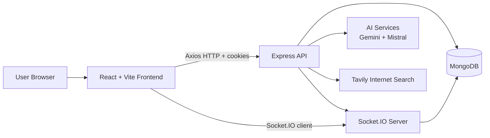

# Perplexity Clone

Perplexity is a full-stack AI chat application built as a split-tier system with a React/Vite frontend and an Express/MongoDB backend. The product is organized around authenticated conversational workflows: users register, log in, create chats, send messages, receive AI-generated replies, and persist conversation history across sessions.

## System Overview

At a high level, the application uses a layered architecture:

- Presentation layer: React UI, route handling, and local interaction state.
- API layer: Express HTTP endpoints for authentication and chat CRUD operations.
- Domain layer: controllers, validators, middleware, and business rules.
- Integration layer: Socket.IO for real-time event delivery, MongoDB via Mongoose for persistence, and external AI/search providers for inference and enrichment.

The backend is intentionally stateless at the process level. Session continuity is achieved with an httpOnly JWT cookie, which is validated on each request and also used to authenticate the Socket.IO connection. That makes the system cookie-driven, token-based, and relatively simple to scale horizontally behind a load balancer.

## Architecture Diagram



## Core Functionality

### Authentication and Identity

The auth subsystem implements classic credential-based authentication with password hashing, JWT issuance, and cookie-based transport.

- Registration creates a new user record with a unique username and email.
- Passwords are hashed with bcrypt before persistence.
- Login performs credential verification and mints a signed JWT.
- The JWT is stored in an httpOnly cookie to reduce exposure to client-side JavaScript.
- The `get-me` endpoint hydrates the current user during application bootstrap.
- Logout clears the cookie and invalidates the browser-side authenticated session.

This creates a secure-ish, low-friction auth pipeline with server-side verification and no local storage token handling.

### Chat Workflow

The chat subsystem is a conversational orchestration pipeline:

- A user submits a prompt through the UI.
- The backend either creates a new chat thread or attaches the message to an existing conversation.
- The user message is stored in MongoDB as a durable message event.
- The backend sends the message history to the AI layer.
- The AI layer generates the assistant response.
- The assistant message is persisted and broadcast over Socket.IO.
- The frontend merges the response into Redux state and renders the updated thread.

This is effectively an event-driven request/response loop with persistent storage and real-time fan-out.

### Real-Time Transport

Socket.IO is used as the real-time delivery mechanism for chat events. On connection, the server reads the auth cookie, verifies the JWT, and places the socket into a user-scoped room such as `user:<id>`. That room-based topology enables targeted message emission instead of broadcasting to every client.

The result is a lightweight pub/sub style channel where each authenticated user receives only their own conversation events.

## Backend Architecture

The backend is organized by responsibility:

- `src/app.js` configures the Express middleware stack and mounts the API routers.
- `server.js` bootstraps the HTTP server, connects MongoDB, and initializes Socket.IO.
- `controllers/` contains application logic and request/response transformation.
- `routes/` maps resource endpoints to controller actions.
- `middlewares/` performs JWT authentication and request gating.
- `validators/` enforces input shape and request contract validation.
- `models/` defines the persistence schema and Mongoose behavior.
- `services/` encapsulates external provider calls and AI/internet integrations.
- `sockets/` handles real-time connection lifecycle and room membership.

### Express Middleware Stack

The server applies the following middleware pipeline:

- JSON and URL-encoded body parsing.
- Cookie parsing for auth token extraction.
- CORS configuration with credential support.
- Morgan request logging for observability and debugging.

The backend exposes a simple health check on `/` and then routes requests into `/api/auth` and `/api/chats`.

### Controllers and Business Logic

The controllers are the main orchestration boundary:

- `auth.controller.js` handles register, login, session hydration, and logout.
- `chat.controller.js` handles send-message, chat listing, message retrieval, and chat deletion.

These controllers perform authorization checks, persistence operations, AI invocation, and socket emission. In other words, they coordinate the unit of work rather than just forwarding traffic.

### Persistence Layer

MongoDB is accessed through Mongoose models:

- `User` stores username, email, and hashed password.
- `Chat` stores the conversation owner and the chat title.
- `Message` stores the chat reference, content payload, role, and timestamps.

The schema design supports a normalized conversation graph with one-to-many relationships:

- one user can own many chats,
- one chat can contain many messages,
- each message belongs to exactly one chat.

This structure gives the app a clean aggregate boundary for conversation retrieval and history replay.

## Frontend Architecture

The frontend is a single-page application built with React 19 and Vite.

- `main.jsx` mounts the app and injects the Redux provider.
- `app/App.jsx` performs the initial auth probe and renders the router.
- `app/app.routes.jsx` defines the public and protected routes.
- `app/app.store.js` configures the Redux store.
- `features/auth/` contains auth slice logic, hooks, API adapters, and login/register pages.
- `features/chat/` contains chat slice logic, hooks, API adapters, socket integration, and the dashboard experience.

The client uses a feature-sliced structure, which is a practical form of modular frontend architecture. This reduces coupling, keeps domain logic localized, and makes state boundaries easier to reason about.

### State Management

Redux Toolkit is used as the canonical client-side state container.

- `auth.slice.js` tracks the current user, loading state, auth-checking state, and errors.
- `chat.slice.js` stores chat entities, the active chat, loading state, and errors.

The chat slice also performs message deduplication to avoid double renders when an HTTP response and a socket event describe the same payload. That is a useful idempotency safeguard in a real-time UI.

### Routing and Access Control

React Router handles client-side navigation.

- `/login` and `/register` are public routes.
- `/` is the protected dashboard.
- `/dashboard` redirects to `/` for route normalization.

The `Protected` wrapper acts as an authorization gate so unauthenticated users cannot access the workspace shell.

### Network Layer

The frontend talks to the backend through Axios with `withCredentials: true`, which is essential because the JWT is stored in a cookie rather than in local storage.

- `auth.api.js` wraps register, login, get-me, and logout.
- `chat.api.js` wraps send-message, list-chats, fetch-messages, and delete-chat.
- `chat.socket.js` manages Socket.IO connection lifecycle and event subscription.

## Request Lifecycle

### Sign Up / Sign In

1. The user submits credentials from the UI.
2. The frontend calls the auth API with credentials included.
3. The backend validates the payload and either creates or authenticates the user.
4. A JWT cookie is set and returned to the browser.
5. The frontend hydrates the user into Redux state.

### Sending a Message

1. The dashboard dispatches a message through the chat hook.
2. The API persists the user prompt.
3. If needed, a new chat thread is created and titled with the AI title generator.
4. The message history is assembled and passed into the inference pipeline.
5. Gemini generates the assistant completion.
6. The response is stored in MongoDB.
7. The server emits a `chat:message` event to the authenticated user room.
8. The frontend reconciles the local state with the returned payload.

This is a hybrid architecture: request/response for durability and Socket.IO for near-real-time UX.

## AI And External Integrations

The backend integrates with multiple external providers:

- Gemini is used for response generation.
- Mistral is used for chat title generation.
- Tavily is available for internet search enrichment.

The service layer isolates those dependencies behind thin orchestration functions, which helps keep provider-specific concerns out of controllers and makes future model swaps less invasive.

## Security Model

The main security properties are:

- password hashing with bcrypt,
- JWT signing with a server secret,
- httpOnly cookie storage,
- origin-restricted CORS,
- authenticated route guards,
- chat ownership checks on every resource query,
- socket-level identity verification on connect.

This is not a zero-trust architecture, but it does enforce a clear trust boundary between anonymous clients and authenticated user sessions.

## Development Scripts

### Backend

- `npm run dev` starts the API with nodemon.
- `npm start` runs the server in production mode.

### Frontend

- `npm run dev` starts the Vite development server.
- `npm run build` produces a production bundle.
- `npm run preview` serves the production build locally.
- `npm run lint` runs ESLint.

## Environment Variables

The exact set of variables depends on deployment, but the codebase expects values like:

- `PORT` for the backend listener.
- `FRONTEND_URL` for CORS and Socket.IO origin allowlisting.
- `JWT_SECRET` for token signing and verification.
- `MONGODB_URI` for the database connection.
- `GEMINI_API_KEY` for the primary response model.
- `MISTRAL_API_KEY` for chat title generation.
- `TAVILY_API_KEY` for search enrichment.
- `VITE_API_URL` for the frontend API base URL.

## Deployment Notes

The frontend is a Vite SPA, so client-side routing needs rewrite support in production hosting. The repository already includes Vercel-oriented configuration, which is the correct pattern for SPA fallback routing: every unknown route should resolve to `index.html` rather than to the filesystem path.

The backend is a separate Node service, so production deployment should treat it as an independent API process with its own environment, network origin, and database connection string.

## Folder Structure

```text
backend/
  src/
    config/         # database bootstrap and infrastructure setup
    controllers/    # request orchestration and business logic
    middlewares/    # auth and request guards
    models/         # Mongoose schemas and persistence entities
    routes/         # endpoint composition
    services/       # AI and internet provider integrations
    sockets/        # Socket.IO bootstrap and room management
    validators/     # request validation rules

frontend/
  src/
    app/            # router, store, root shell, global styling
    features/
      auth/         # auth flows, hooks, slices, and pages
      chat/         # chat flows, hooks, slices, and socket client
```

## In Short

This project is a full-stack conversational AI platform with:

- JWT-based authentication,
- cookie-backed session continuity,
- MongoDB persistence,
- React + Redux client state management,
- Express REST APIs,
- Socket.IO real-time synchronization,
- multi-provider AI orchestration,
- and a clean separation between presentation, application, domain, and infrastructure concerns.

It is basically a modular, event-driven, authenticated chat system with durable history and server-mediated AI inference.
